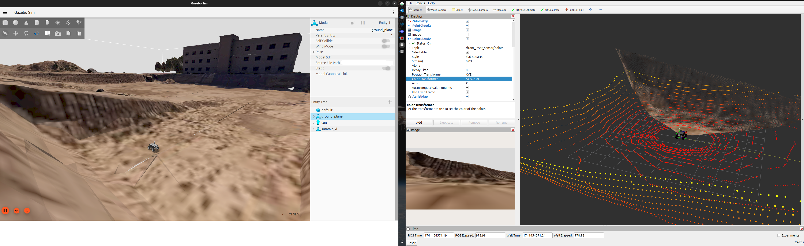

# URJC excavation World ROS package

The simulation enviroment is based on URJC Fuenlabrada Campus, where it is located this ground. This world could be used to create new algorithms in localization or navigation. 





# Include the world from another package

<!-- * Update .rosinstall to clone this repository and run `rosws update` -->
<!-- ```
- git: {local-name: src/urjc-excavation-world, uri: 'https://github.com/juanscelyg/urjc-excavation-world.git', version: main}
``` -->
* Add the following to your launch file:
```python
    urjc_excavation = launch.actions.IncludeLaunchDescription(
        launch.launch_description_sources.PythonLaunchDescriptionSource(
            os.path.join(
                get_package_share_directory('urjc_excavation_world'),
                'launch',
                'urjc_excavation.launch.py')))
```

# Load directly into Gazebo (without ROS)
```bash
export GAZEBO_MODEL_PATH=`pwd`/models
gz sim worlds/urjc_excavation.world
```

# ROS Launch with Gazebo viewer (without a robot)
```bash
# build for ROS
source /opt/ros/jazzy/setup.bash
source /usr/share/gazebo/setup.sh
rosdep install --from-paths . --ignore-src -r -y
colcon build

# run in ROS
source install/setup.sh
ros2 launch urjc_excavation_world urjc_excavation.launch.py
```
There is another world with a few models to interact with. You can load it with the following command:

```bash
ros2 launch urjc_excavation_world urjc_excavation_msr.launch.py
```
# Lights and Shadows configuration

For to obtain a better performance the shadows were disabled. If you want to enable them, you can do it in the file `urjc_excavation.world` or in  `urjc_excavation_msr.world` , modifying the line:

```xml
<cast_shadows>0</cast_shadows>
```
to

```xml
<cast_shadows>1</cast_shadows>
```

<!-- # Building
Include this as a .rosinstall dependency in your SampleApplication simulation workspace. `colcon build` will build this repository.

To build it outside an application, note there is no robot workspace. It is a simulation workspace only.

```bash
rosws update
rosdep install --from-paths . --ignore-src -r -y
colcon build
``` -->
